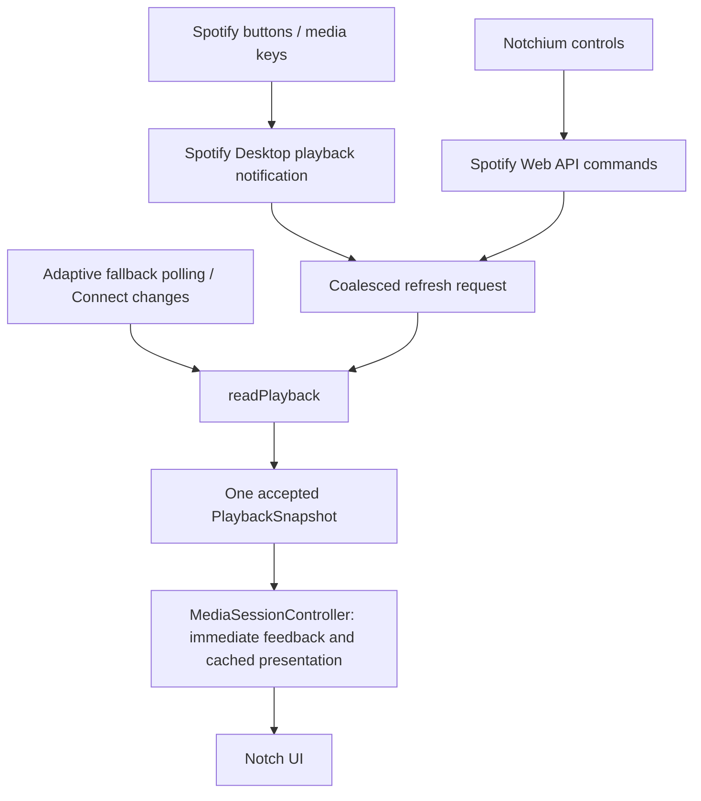

# Spotify playback pipeline

## Ownership

`RealMediaProvider` owns playback observations. There is exactly one playback GET and ingestion
function, `readPlayback(reason:)`, used by polling, explicit refresh, command completion,
Spotify Desktop notifications, resume, and Connect transfer. `MediaState` (also named
`PlaybackSnapshot`) carries track ID, title, artist, artwork URL, duration, elapsed baseline,
rate, device, wall-clock observation time, monotonic sample time, and request start time.

The controller no longer owns a pending track-transition state machine, a seek confirmation
predicate, or a competing playback-state intent. A local action can immediately rebase the
presentation snapshot for seek or play/pause. A request-start timestamp barrier excludes
already-buffered pre-action snapshots. Every later authoritative observation replaces playback
fields together. The last authoritative snapshot exists only for failure recovery and inactive
cached presentation. Shuffle/repeat/volume feedback does not override track or progress fields.
Connect device identity also arrives through the playback snapshot instead of being rebuilt in
the controller after a transfer command.

## Commands, ordering, and bounded reconciliation

Transport sends commands through `SpotifyPlaybackAPI`; it does not build track metadata or
progress snapshots. A command invalidates older reads, sends its request, and requests the same
authoritative read used by external events. Completion invalidates reads begun during command
execution too. Request guards finish independently of reconciliation.

`PlaybackReconciliation` is one provider-owned, short-lived read expectation. Next and Previous
share the same track-change condition. Seek accepts the requested position plus the possible
elapsed interval since the action, including a delayed restart at zero. Playback and device
expectations use their respective fields. External events can supersede a command expectation.
Unchanged observations trigger at most three retries, separated by 250 ms, 500 ms, and 1 second.
Confirmation clears the expectation. Exhausting the budget also clears it, so normal polling
cannot remain filtered by a completed command. A monotonic ten-second safety bound applies
while requests are delayed. Errors and Spotify's shared Retry-After cooldown remain bounded.

A monotonically increasing observation revision rejects older reads, including errors and
responses returning after a newer action or event. Publication rechecks the revision after its
asynchronous cooldown lookup. The input revision owns a retry budget; ordinary reads cannot
cancel it. Lifecycle generations apply only to authorization/disconnect/shutdown boundaries.
No transition or confirmation flag disables the fallback poller.

## Previous and progress

Previous retains the existing three-second choice: above the threshold, rebase the local
snapshot to zero and send seek-to-zero; otherwise send Previous. There is no pendingPrevious
state. Spotify's [Previous endpoint](https://developer.spotify.com/documentation/web-api/reference/skip-users-playback-to-previous-track)
documents skipping to the prior queue entry, not the required restart threshold. The installed
Spotify scripting dictionary likewise describes its Previous command as a skip, so this
refactor does not assume native commands implement the desired threshold.

The visible progress clock uses `elapsed + monotonic elapsed time × playbackRate`, bounded by
the current duration. Every new snapshot or optimistic rebase replaces the timestamp and
baseline together. Wall-clock timestamps remain for persistence and deterministic fixtures;
the live progress view supplies uptime, so changing system time cannot move the progress bar.

## Desktop and media-key events

`SpotifyDesktopPlaybackEvents` observes only `com.spotify.client.PlaybackStateChanged` through
Foundation's [DistributedNotificationCenter](https://developer.apple.com/documentation/foundation/distributednotificationcenter).
The event is an empirical Spotify Desktop integration, demonstrated by this
[notification listener and payload](https://gist.github.com/loretoparisi/6092634d34e97a062029b078215b6bdc),
not a guaranteed Spotify Web API contract. Track ID, playback state, and position are optional
refresh hints. Notification metadata never becomes the displayed track, and it never overrides
which Spotify Connect device is active.

The listener consumes signals independently of network requests, so a new event invalidates an
old in-flight response immediately. The first event requests a refresh immediately; further
events share a bounded buffer and a 250 ms trailing refresh window. One listener is owned by
the authenticated provider. Disconnect, shutdown, and authorization changes cancel listener,
observer, and refresh tasks. Missing or malformed events fall back to ordinary polling.

Spotify buttons and media keys that change Spotify Desktop playback produce the same kind of
signal. No global keyboard monitor or Accessibility permission is added. If another device or
client does not emit this local event, Web API polling reconciles it. Poll intervals remain
5 seconds playing / 15 seconds inactive when collapsed, and 2.5 seconds playing / 5 seconds
paused / 10 seconds inactive when expanded. Core Audio still supplies only local audio activity
and waveform, with its existing inactive-playback wakeup routed to this same refresh pipeline.

Commands, authoritative metadata/progress, queue, volume, OAuth, and Connect discovery/transfer
continue using the Web API. Local AppleScript transport was inspected but is not enabled: it
would introduce a separate Automation permission path and lacks a verified restart contract.
The fast local integration in this refactor is event delivery, with Web API reconciliation.

## Validation

Deterministic tests cover shared Next/Previous acceptance, delayed restart, monotonic expiry,
request-start rejection, buffered pre-action samples, notification parsing, actual observer
callback delivery through an injected NotificationCenter, one listener and teardown, an event
arriving during an old playback read, and external Spotify/media-key event sequences. They
also cover Previous → Next → Previous → Pause → Play, subsequent external position changes,
and five simulated minutes of automatic polling after Previous.

The macOS Swift package build and test suite are the automated validation. Physical Spotify
buttons/media keys, signed-app notification delivery on the user's current Spotify version,
and long-duration live playback remain manual checks; simulated events are not live testing.

Final automated run: **199 tests passed**, zero failures, with the fixed-port OAuth loopback
and display-dependent `NSScreen` test excluded for the previously observed environment limits.
`swift test` built the package successfully; `git diff --check` passed. This is not a signed
application build or a physical media-key test.

## Files changed in this refactor

- `NotchiumPackage/Sources/NotchiumServices/RealMediaProvider.swift`
- `NotchiumPackage/Sources/NotchiumServices/MediaService.swift`
- `NotchiumPackage/Sources/NotchiumServices/PlaybackReconciliation.swift` (new)
- `NotchiumPackage/Sources/NotchiumServices/SpotifyPlaybackEvents.swift` (new)
- `NotchiumPackage/Sources/NotchiumMediaFeature/MediaFeatureModel.swift`
- `NotchiumPackage/Sources/NotchiumMediaFeature/MediaProgressView.swift`
- `NotchiumPackage/Tests/NotchiumFeatureTests/MediaControlTests.swift`
- `NotchiumPackage/Tests/NotchiumFeatureTests/MediaProgressTests.swift`
- `NotchiumPackage/Tests/NotchiumFeatureTests/SpotifyMediaTests.swift`
- `NotchiumPackage/Tests/NotchiumFeatureTests/PlaybackPipelineTests.swift` (new)
- `docs/MEDIA_CENTER.md`
- `docs/SPOTIFY_PLAYBACK_PIPELINE.md` (new)
